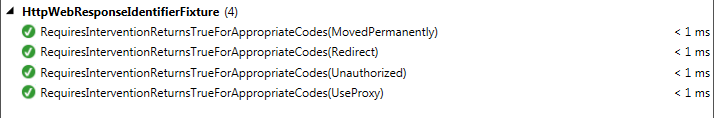

# NUnit ValueSource: the Complete Tutorial

NUnit's 'Values' and 'ValueSource' attributes allow you to greatly reduce the number of unit tests that you need to write. With these two attributes, you can get better coverage in less time.

## The Hard Way

Let's say you're designing a feature for your app that retrieves a list of software updates. Specifically, let's say you are writing a method that takes the 'System.Net.HttpStatusCode' value from the web response and returns true if some sort of intervention is required. If the 'HttpStatusCode' is one of 'Moved', 'Rediret', 'Unauthorized', or 'UseProxy', your method should return 'true', indicating that the application should take some corrective measure.

Without 'Values' or 'ValueSource', you would start writing test methods like this:

```csharp
[Test]
public void RequiresInterventionReturnsTrueForMoved()
{
    Assert.IsTrue(
        GetClassUnderTest().RequiresIntervention(HttpStatusCode.Moved));
}

[Test]
public void RequiresInterventionReturnsTrueForRedirect()
{
    Assert.IsTrue(
        GetClassUnderTest().RequiresIntervention(HttpStatusCode.Redirect));
}

[Test]
public void RequiresInterventionReturnsTrueForUnauthorized()
{
    Assert.IsTrue(
        GetClassUnderTest().RequiresIntervention(HttpStatusCode.Unauthorized));
}

[Test]
public void RequiresInterventionReturnsTrueForUseProxy()
{
    Assert.IsTrue(
        GetClassUnderTest().RequiresIntervention(HttpStatusCode.UseProxy));
}
```

There's no technical reason that you could not put all four of the `Assert`s in a single method, however this is generally considered bad form. The main reason is that if the first `Assert` fails, the test runner will not run the remaining three. This means if your method gives the wrong result for the first and fourth `Assert`s, you would see only the first one when you run your tests. Only after you fixed the first one and then re-ran the tests would you see that the fourth was also failing.

## Using the Values Attribute

Wouldn't it be nice, though, if you had to write only a single test method? Consider a typical unit test scenario where the test set up is more complex. In such a case, a single method would limit duplication and reduce maintenance costs. It would also be easier to read.

That's where the `Values` attribute comes in. It allows you to write a single test method that is functionally equivalent to the entire set of tests above.

```csharp
[Test]
public void RequiresInterventionReturnsTrueForAppropriateCodes(
    [Values(HttpStatusCode.Moved, HttpStatusCode.Redirect,
        HttpStatusCode.Unauthorized, HttpStatusCode.UseProxy)]
    HttpStatusCode code)
{
    Assert.IsTrue(GetClassUnderTest().RequiresIntervention(code));
}
```

This test method is similar to each of the tests above except that:

1. The test method accepts a parameter named 'code' of type 'HttpStatusCode'
1. The 'Values' attribute is applied to the parameter

Notice too that all four of the 'HttpStatusCode' instances are passed to the 'Value' attribute's constructor.

When you run this test, the test runner calls the test method once for each value in the 'Values' attribute's constructor, each time setting the method's 'code' parameter to that value.

In the test runner's output, each run will show as a separate test with a description which includes the value passed in. And here's where this approach trumps simply putting four asserts in a single method: if the first one fails, the other three will still run.


This is good, but we're just getting started.

## Reusing Values

So far, the 'Values' attribute has saved some duplication, but let's say you want to use the same set of values in another test method. Imagine you now want to create a unit test for 'IsSuccessful', another method in our class, to ensure that it returns 'false' for all the codes that 'RequiresIntervention' returns 'true' for.

You could use the 'Values' attribute again, however, that would mean we'd have the list of "requires intervention" codes in two places in your unit tests. If you ever modified 'RequiresIntervention', you would need to update both sets of values in our unit tests. If you forgot one, your tests would still pass, but they would be incomplete, allowing bugs to creep in unannounced.

This sounds like a job for the 'ValueSource' attribute.

To use this attribute, let's start by creating an array of 'HttpStatusCode' instances in your fixture.

```csharp
private static readonly HttpStatusCode[] RequiresInterventionCodes =
{
    HttpStatusCode.Moved,
    HttpStatusCode.Redirect,
    HttpStatusCode.Unauthorized,
    HttpStatusCode.UseProxy
};
```

Now, let's modify the existing unit test with 'ValueSource' attribute.

```csharp
[Test]
public void RequiresInterventionReturnsTrueForAppropriateCodes(
    [ValueSource("RequiresInterventionCodes")]
    HttpStatusCode code)
{
    Assert.IsTrue(GetClassUnderTest().RequiresIntervention(code));
}
```

All that's changed is the attribute on the method parameter. Note that the constructor of the 'ValueSource' attribute accepts a string containing the name of the array.

Similarly to the 'Values' attribute, the test is run once per item in the array, passing that value to the method's 'code' argument.

If you run this, you'll see the exact same output as the 'Values' version.

Now that you've refactored the existing test method such that the values are external to the method, you can reuse the array in others tests. Here's a test for the 'IsSuccessful' method.

```csharp
[Test]
public void IsSuccessfulReturnsFalseForRequiresInterventionCodes(
    [ValueSource("RequiresInterventionCodes")]
    HttpStatusCode code)
{
    Assert.IsFalse(GetClassUnderTest().IsSuccessful(code));
}
```

Here's the key benefit: you've declared the array once, but thanks to the 'ValueSource' attribute, you can use it in multiple test methods.

If you run in the test runner, you see each test method listed 4 times, each with their respective value from 'RequiresInterventionCodes'.


## Programmatically Creating a Source

Your existing test for 'RequiresIntervention' is good and correct, but testing that it returns 'true' for the correct values is not enough. You also want to test that the method returns 'false' for all other values.

So, clearly you would prefer to write only a single test method to test all other values. You could create another static array with all the other values of the enum. But this has three problems.

1. The 'HttpStatusCode' enum holds dozens of values. The list of values which don't require intervention would be huge.
1. What happens if a new value is added to the enum? Let's say you go down the path of maintaining two separate arrays. When a value is added, your test becomes outdated and you have no way of knowing it.
1. Maintaining two lists is really a subtle form of duplication. You would have two different members that both identify which values require intervention (one by inclusion, one by omission). Both of these need to be kept in sync. Plus, you would need to write some mechanism to verify that the lists are in sync.

So what can be done?

Instead of another array, let's create a method to return the list of 'HttpStatusCode' values which are not in the 'RequiresInterventionCodes' array.

```csharp
private static IEnumerable NonRequiresInterventionCodes()
{
    return Enum.GetValues(typeof (HttpStatusCode))
        .OfType()
        .Except(RequiresInterventionCodes);
}
```

Fortunately, the 'ValueSource' attribute accepts methods as well. So, if you declare the above method in your fixture, you can write the following test.

```csharp
[Test]
public void RequiresInterventionReturnsFalseForAllOtherCodes(
    [ValueSource("NonRequiresInterventionCodes")]
    HttpStatusCode code)
{
    Assert.IsFalse(GetClassUnderTest().RequiresIntervention(code));
}
```

This is very similar to the previous 'ValueSource' unit test except that is asserts that:

* the return value is false and
* the string passed to the 'ValueSource' attribute's constructor is the name of your method.

If you were to run this method, you would get the following.


## It's Easy to Get the Name Wrong

If you're thinking, "It takes a Hard coded string? Isn't that kinda fragile?", I understand your skepticism. It's not ideal.

The good news is that, as of NUnit 2.6.2, if your string doesn't match an actual non-null static field, property, or method, you'll get an error when you run your test. Pre NUnit 2.6.2 it would fail silently.

If you're on C# 6.0 or higher you can take advantage of the 'nameof' operator.

```csharp
[Test]
public void RequiresInterventionReturnsFalseForAllOtherCodes(
    [ValueSource(nameof(RequiresInterventionCodes))]
    HttpStatusCode code)
{
    Assert.IsTrue(GetClassUnderTest().RequiresIntervention(code));
}
```

This means that errors are caught at compile time. It also means that if you rename the array with a refactoring tool, it will update it in all 'ValueSource' constructors as well.

## Types of Things You Can Use With the Value Attribute

Another downside of using the 'Values' attribute is that it requires that what you pass to its constructor be either a constant expression, a call to 'typeof', or an array creation expression.

Here are the types of things you can put in a `Values` attribute.

```csharp
// Constant expressions
public void Valid([Values(3,2,1)] int val) { ... }
public void Valid([Values("blah", "foo")] string val) { ... }
public void Valid(
    [Values(HttpStatusCode.Unauthorized, HttpStatusCode.SwitchingProtocols)]
    HttpStatusCode val)
    { ... }
public void Valid([Values(typeof(HttpStatusCode))] Type val) { ... }
public void Test([Values(3 * 2, 2 * 8)] int val) { ... }
public void Test([Values("blah" + "blah", "foo" + "bar")] string val) { ... }

// Array creation expressions... Note that this runs only twice
public void Test([Values(new[]{1,2,3}, new[]{4,5,6})] int[] val) { ... }

// Constant expressions using declared constants
private const int MyInt1 = 1;
private const int MyInt2 = 2;
private const int MyInt3 = 3;
public void Test([Values(MyInt1, MyInt2, MyInt3)] int val) { ... }
public void Test([Values(MyInt1 * MyInt3, MyInt2 * MyInt3)] int val) { ... }
```

## For Other Types of Objects, Use a ValueSource Attribute

What you don't see in the code snippets above is passing class instances in through the 'Values' attribute. That's because class instances aren't constants.

This seems like a big limitation.

For example, let's say instead of an 'HttpStatusCode' instance, your 'RequiresIntervention' method accepted a 'WebResult' instance (some made up class to wrap a 'HttpStatusCode'). You may want to write a test like the following.

```csharp
[Test]
public void RequiresInterventionReturnsTrueForAppropriateCodes(
    [Values(new WebResult(HttpStatusCode.Moved, "Page moved"),  /*...*/ )]
    WebResult result)
{
    Assert.IsTrue(GetClassUnderTest().RequiresIntervention(result));
}
```

If you did, you would get the following compile error: "An argument must be a constant expression, typeof expression or array creation expression of an attribute parameter type."

Fortunately, you can get around this limitation with the 'ValueSource' attribute.

First, define an array with all the class instances.

```csharp
private static readonly IEnumerable RequiresInterventionWebResults = new[]
{
    new MyWebResult(HttpStatusCode.Moved, "Page moved"),
    new MyWebResult(HttpStatusCode.Redirect, "Requires redirect"),
    new MyWebResult(HttpStatusCode.Unauthorized, "Unauthorized request"),
    new MyWebResult(HttpStatusCode.UseProxy, "Try using proxy")
};
```

Then use that array in the 'ValueSource' constructor.

```csharp
[Test]
public void RequiresInterventionReturnsTrueForAppropriateCodes(
    [ValueSource("RequiresInterventionWebResults")]
    MyWebResult result)
{
    Assert.IsTrue(GetClassUnderTest().RequiresIntervention(result));
}
```

If you were to run the above test, you would get output like:


If you override the 'ToString' method of the 'MyWebResult' class you'll get the expected one row per value like:


Prior to NUnit 3, if you ran the above test, it would show one result per value passed to the method regardless of whether the 'ToString' method was overridden. The downside was that the output wasn't particularly useful since the default 'ToString' implementation returns the class name. That's not very useful for interpreting which test is which.

## When Your ValueSource Source is in a Different Class

Let's say you have another class, a UI layer class, with a method that determines whether to show a warning indicator to the user. As it turns out, the requirement is that it should show the indicator under the same conditions as our existing method 'RequiresIntervention' returns true.

It's easy enough to write the code.

```csharp
public bool ShowWarning(HttpStatusCode code)
{
    return new[]
    {
        HttpStatusCode.Moved,
        HttpStatusCode.Redirect,
        HttpStatusCode.Unauthorized,
        HttpStatusCode.UseProxy
    }.Contains(code);
}
```

But what about unit tests? You could create an array in both test fixtures and use it. But there is a way to share a common array between both fixtures.

The 'ValueSource' attribute has two constructors. Up until now we've just used one.

The other constructor accepts a 'Type' and a 'string'. The 'string' is still the name of the member to use as the value source. The 'Type' tells 'ValueSource' where to look for the member. The member must be static or else 'ValueSource' cannot access it. (ValueSource will not try to construct an instance of the type and access its members.)

So, let's create a class and move the WebResult array from your existing test fixture.

```csharp
public static class HttpStatusCodeCommon
{
    private static readonly HttpStatusCode[] IntervnetionCodes =
    {
        HttpStatusCode.Moved,
        HttpStatusCode.Redirect,
        HttpStatusCode.Unauthorized,
        HttpStatusCode.UseProxy
    };

    public static IEnumerable<HttpStatusCode> RequiresInterventionCodes
    {
        get { return InterventionCodes; }
    }
}
```

If you were to try to run the test now that the array is no longer in the test fixture, you would get an error because the member cannot be found. To fix this, update your existing test to provide the type which contains 'RequiresInterventionCodes'.

```csharp
[Test]
public void RequiresInterventionReturnsTrueForAppropriateCodes(
    [ValueSource(typeof(HttpStatusCodeCommon), "RequiresIntervnetionCodes")]
    HttpStatusCode code)
{
    Assert.IsTrue(GetClassUnderTest().RequiresIntervention(code));
}
```

Now the test compiles and runs correctly. From here, you can create a new fixture for your new class and use the common 'RequiresInterventionCodes' property there as well.

```csharp
[Test]
public void ShowWarningReturnsTrueForAppropriateCodes(
    [ValueSource(typeof(HttpStatusCodeCommon), "RequiresIntervnetionCodes")]
    HttpStatusCode code)
{
    Assert.IsTrue(GetClassUnderTest().ShowWarning(code));
}
```

It may be surprising that you need to do the same thing for value sources in nested fixtures. If you use nested fixtures as a way of organizing your tests, you may find it convenient to put a value source in the outer fixture and access it in several inner fixtures. If so, the same rules apply; you will need to pass the type of the outer fixture to the 'ValueSource' constructor.

## Values or ValueSource Attributes on Multiple Parameters

Up until now, we've only looked at test methods with single parameters. What happens if there's more than one?

Let's say you want to add a 'ShouldRetry' method to your existing class. It accepts an 'HttpStatusCode' and determines whether it makes sense to retry the request. For example, if the status is 'RequestTimeout' then it may make sense to try the request again.

However, you don't want to keep trying a request indefinitely, so 'ShouldRetry' also accepts an integer: the number of previous retries. The method return 'true' if the code is a retry code and there have been 2 or fewer previous retries. Otherwise, it will return 'false'.

Here's the what the code would look like:

```csharp
private readonly HttpStatusCode[] _retryHttpStatusCodes =
{
    HttpStatusCode.GatewayTimeout,
    HttpStatusCode.RequestTimeout
};

public bool ShouldRetry(HttpStatusCode code, int previousAttempts)
{
    return _retryHttpStatusCodes.Contains(code) && previousAttempts < 3;
}
```

How do you unit test this?

Fortunately, NUnit let's you test combinations of parameters. Here is a test that has both a 'code' parameter and a 'retries' parameter. It tests that the method returns 'true' when the code is one of the expected codes and the retry count is either 1 or 2.

Note that the 'code' parameter has a 'ValueSource' attribute and the 'retries' parameter has a 'Values' attribute. You can mix and match these two attributes all you want.

```csharp
private static readonly HttpStatusCode[] RetryCodes =
{
    HttpStatusCode.GatewayTimeout,
    HttpStatusCode.RequestTimeout
};

[Test]
public void ShouldRetryReturnsTrueForAppropriateCodesAndLowValues(
    [ValueSource("RetryCodes")] HttpStatusCode code,
    [Values(1,2)] int retries)
{
    Assert.IsTrue(GetClassUnderTest().ShouldRetry(code, retries));
}
```

So, what happens when you run this?

By default, NUnit will run this test once for every combination of the values. In this case, it will run the method four times, passing "GatewayTimeout, 1", "GatewayTimeout, 2", "RequestTimeout, 1", and "RequestTimeout, 2" successively.


## When You Have More Than Two Parameters With Value or ValueSource

Let's say your class accepts a 'maxRetries' value. Rather than hard coding maximum retries, the value is passed in through the constructor.

You now have three parameters you'd like to test: status code, actual retries, and max retries.

As you might expect, the test method simply adds a third parameter with its own 'Values' attribute.

```csharp
[Test]
public void ShouldRetryReturnsTrueForAppropriateCodesAndLowValuesAndMaxRetries(
    [ValueSource(typeof (HttpStatusCodeCommon), "RetryConnectionCodes")]
    HttpStatusCode code,
    [Values(1, 2)] int retries,
    [Values(3, 4)] int maxRetries)
{
    Assert.IsTrue(GetClassUnderTest(maxRetries).ShouldRetry(code, retries));
}
```

What happens when this test is run? The test runner once again runs the test method once for every combination of inputs.


Trying all combinations of values is the default behaviour, but it may not be what you want. NUnit gives you more options for processing multiple parameters.

## The Sequential Attribute

The first option is to take the values sequentially.

In sequential mode, instead of trying every combination of values, NUnit will run once passing the first value for each parameter. Then it will run once passing the second value for each parameter, and so on.

To run the test sequentially, you just need to add the 'Sequential' attribute to the test method.

```csharp
[Sequential]
[Test]
public void ShouldRetryReturnsTrueSequential(
    [ValueSource(typeof (HttpStatusCodeCommon), "RetryConnectionCodes")]
    HttpStatusCode code,
    [Values(1, 2)] int retries,
    [Values(3, 4)] int maxRetries)
{
    Assert.IsTrue(GetClassUnderTest(maxRetries).ShouldRetry(code, retries));
}
```

If you run this test, you get the following.


One tricky thing with using the 'Sequential' attribute is that you'll want to make sure that you provide the same number of values to each parameter. For example, in the example above, let's say you later decided that you want to test two more retry/max retry pairs. So you add another value for each the 'retries' and 'maxRetries' parameters. In this case, the first parameter has only 2 values while the others have 3 each. If you run this, when it runs the method the third time it will pass 'null', '3', and '5' to test method parameters respectively.


In this particular case, the third test fails.

There are other ways to test sets of values sequentially. If you find a use for the 'Sequential' attribute, you will likely be better off using the `TestCase` method attribute instead of 'Values' or 'ValueSource'.

## The PairWise Attribute

There's a third potential behaviour for multiple parameters.

Let's say you set up a test method with three or more parameters using the default method (testing all combinations) but you find that it takes too long to run. You decide that testing all combinations is overkill, but you still want to test a lot of combinations.

Using sequential would be too much effort. That's were the 'PairWise' attribute shines.

The 'PairWise' attribute is similar to the default behaviour, except that instead of an exhaustive list of combinations, it tests every pair of values.

Let's say you have parameters A, B, and C. A has 100 values, B has 50, and C has 40. There are 200,000 combinations. Pair wise makes sure that every value of A is tested with every value of B, and that every value of A is tested with every value of C.  It also makes sure that every value of B is tested with every value of C.

What's the difference? The default behaviour ensures that every value of A is tested with every combination of B and C.

Using 'PairWise', the test would run only 5000 times. That's still a lot of coverage but runs way faster.

To help understand the difference between these three methods, let's look at some fake data sources for A, B, and C.
The source for A has 3 values: a, b, c.
The source for B has 2 values: n, p
The source for C has 2 values: y, z

The combinatoric approach would run the test with the following tuples: (a,n,y), (a,p,y), (a,n,z), (a,p,z), (b,n,y), (b,p,y), (b,n,z), (b,p,z), (c,n,y), (c,p,y), (c,n,z), (c,p,z).

The sequential approach would run the test with the following tuples: (a,n,y), (b,p,z), (c,null,null).

The pair wise approach would run the test with the tuples like: (a,n,y), (a,p,z), (b,n,y), (b,p,z), (c,n,y), (c,p,z).

Exactly now NUnit picks which values to test with which isn't worth getting into; by choosing it, you are leaving the choice up to NUnit. You generally don't need to worry about it unless the behaviour of the method under test is highly dependent on all 3 parameters.

As you can see in the pair wise tuples, 'a' is tested with both 'n' and 'p', and with both 'y' and 'z', but not with every combination of those values. Same for 'b' and 'c'.

## Combining Multiple Value and ValueSource Attributes

Let's say you want to add a new method to your class under test, 'IsHandledCode', which returns true if the class knows what to do with the given response code. Essentially, if the class knows how to retry or intervene in some way, this method returns true.

You already have a value source for all the codes which require intervention. And you have one for all the codes which require retry. You definitely don't want to duplicate these lists.

One approach would be to create a new value source method which returns the combination of both lists. Assuming both lists are in your fixture, you could write:

```csharp
private static IEnumerable<HttpStatusCode> GetAllHandledCodes()
{
    return RequiresInterventionCodes
        .Concat(RetryConnectionCodes);
}

[Test]
public void IsHandledCodeReturnsTrueForHandledCodes(
    [ValueSource("GetAllHandledCodes")]
    HttpStatusCode code)
{
    Assert.IsTrue(GetClassUnderTest().IsHandledCode(code));
}
```

This will work just fine. But, there's no need to write the 'GetAllHandledCodes' method. The 'ValueSource' attribute allows multiple attributes on a single parameter. So you can use your existing value sources directly within the test.

```csharp
[Test]
public void IsHandledCodeReturnsTrueForHandledCodes(
    [ValueSource("RequiresInterventionCodes")]
    [ValueSource("RetryConnectionCodes")]
    HttpStatusCode code)
{
    Assert.IsTrue(GetClassUnderTest().IsHandledCode(code));
}
```

As it turns out, this test is missing one status code that the class does handle: the OK code. You don't currently have a value source for it, but you don't need to create one. The 'Value' attribute can be stacked on a parameter with 'ValueSource' attributes.

```csharp
[Test]
public void IsHandledCodeReturnsTrueForHandledCodes(
    [Values(HttpStatusCode.OK)]
    [ValueSource("RequiresInterventionCodes")]
    [ValueSource("RetryConnectionCodes")]
    HttpStatusCode code)
{
    Assert.IsTrue(GetClassUnderTest().IsHandledCode(code));
}
```

If you run this, you'll see that the method is run once for each value contained in the three attributes:


## Values Attribute's Special Cases

The Values attribute provides a few convenient short cuts.

Writing a method to return all values of an enum isn't difficult, but it is a little tedious. Let's say you wanted to test that your 'IsHandledCode' method doesn't throw an exception for any value of 'HttpStatusCode'. Rather than maintaining a list of all codes, which could become outdated, one approach would be to write a method to get all the values for us.

```csharp
private static GetAllHttpStatusCodeValues()
{
  return Enum.GetValues(typeof(Foos)).Cast<Foos>();
}

[Test]
public void IsHandledCodeDoesNotThrowForAnyCode(
    [ValueSource("GetAllHttpStatusCodeValues")]
    HttpStatusCode code)
{
    Assert.DoesNotThrow(() => GetClassUnderTest().IsHandledCode(code));
}
```

As of NUnit 3.0, however, the 'Values' attribute can do the same thing without a method.

```csharp
[Test]
public void IsHandledCodeDoesNotThrowForAnyCode(
    [Values]
    HttpStatusCode code)
{
    Assert.DoesNotThrow(() => GetClassUnderTest().IsHandledCode(code));
}
```

The key difference is that nothing is passed into the 'Values' attribute's constructor.

And as a small bonus, it will do the same for 'bool' parameters, passing both 'true' and 'false'.

Another nice-to-have involves automatically converting date strings.

The obvious way of passing a number of dates to a method would be:

```csharp
private TestData[] testDates = new[]{
    new DateTime(2017,1,1),
    new DateTime(3000,9,1),
    new DateTime(2016,9,7,0,0,1)
};

[Test]
public void TestDate(
    [ValueSource("testDates")]
    DateTime date)
{
    Assert.IsTrue(date > new DateTime(2016,9,7));
}
```

As we've seen above, the 'Values' attribute doesn't work with constructed values, so creating a value source might look like the only option. It would be if NUnit wasn't smart enough to automatically convert date strings. You can do away with the value source and just write:

```csharp
[Test]
public void TestDate(
    [Values("2017/01/01", "3000/09/01", "2016/09/07 00:00:01")]
    DateTime date)
{
    Assert.IsTrue(date > new DateTime(2016,9,7));
}
```

The exact format of the date string depends on your computer settings. The slash format is generally North American. Much of the rest of the world would use dashes instead.

```csharp
[Test]
public void TestDate(
    [Values("2017-01-01", "3000-09-01", "2016-09-07 00:00:01")]
    DateTime date)
{
    Assert.IsTrue(date > new DateTime(2016,9,7));
}
```
